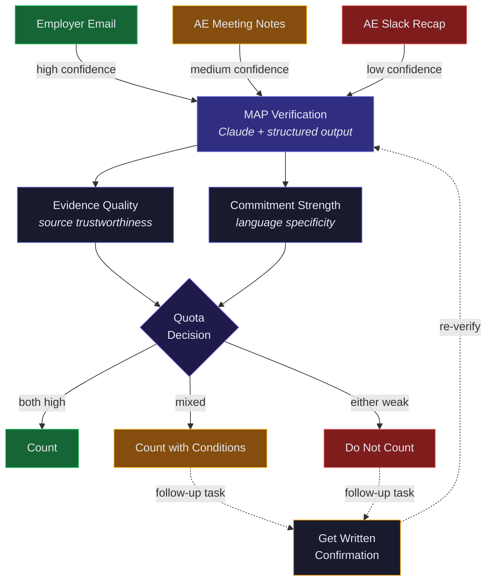

# MAP Verification System — Architecture

Unstructured evidence in, structured quota decision out. Two scoring axes determine whether a commitment counts toward forecast.

---

Generated by [diagram-skill](https://github.com/liamc225/diagram-skill)
