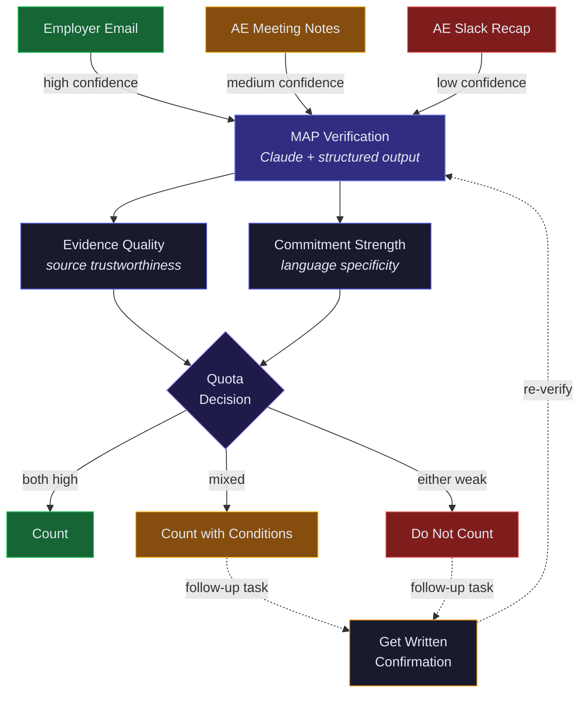

# MAP Verification System

Two-axis scoring of employer commitment evidence for Rula's AE sales motion. Separates **source trustworthiness** (evidence quality) from **commitment specificity** (commitment strength) to surface inflated MAPs before they reach the forecast.

> **[Live demo](https://map-verification-demo.vercel.app?access=rula-case-study-2026)** — paste evidence and see how the system scores it in real-time.

## How it works

Unstructured evidence (emails, meeting notes, Slack messages) goes in. A structured verification assessment comes out — scored on two independent axes that determine a quota recommendation.

| Axis | What it measures | Scale |
|------|-----------------|-------|
| **Evidence Quality** | How trustworthy is the source? Employer email > AE meeting notes > AE Slack recap | 0–1 (strong / moderate / weak) |
| **Commitment Strength** | How firm is the language? Named campaigns + quarters > vague interest | 0–1 (firm / conditional / exploratory) |

The two scores combine into a **quota recommendation**: `count`, `count_with_conditions`, or `do_not_count`.

## Architecture



Two runtime paths share the same core logic — Zod schemas, system prompt, and `messages.parse()` call:

- **Vercel serverless function** (`api/verify.ts`) — powers the interactive demo. Single request/response, ~15s.
- **Trigger.dev task** (`src/trigger/mapVerification.ts`) — queue-based path with retry/backoff for production CRM integration.

Both call Claude's structured output API with `zodOutputFormat`, guaranteeing the response matches the `MAPVerification` schema. No freeform text parsing.

## Project structure

```
├── api/
│   └── verify.ts              # Vercel serverless function (demo API)
├── src/
│   ├── schemas.ts             # Zod schemas — input validation + output format
│   ├── prompt.ts              # System prompt + evidence samples
│   └── trigger/
│       └── mapVerification.ts # Trigger.dev task (queue path)
├── demo/
│   └── index.html             # Static demo page (hardcoded results + interactive form)
├── vercel.json                # Rewrites + function config
├── trigger.config.ts          # Trigger.dev project config
└── DIAGRAM.md                 # Architecture diagram (Mermaid)
```

## Key design decisions

**Structured outputs over freeform** — `messages.parse()` with Zod schemas guarantees downstream systems get valid JSON matching `MAPVerification`. No regex, no "please respond in JSON" prompting.

**Two-axis scoring** — Evidence quality and commitment strength are scored independently. A reviewer can immediately tell whether a low score means "bad evidence" (AE Slack recap) or "weak commitment" (vague interest, no campaigns named). A single composite score would hide this distinction.

**Shared core modules** — `schemas.ts` and `prompt.ts` are imported by both runtime paths. Update the schema or prompt once, both paths stay in sync.

**Access-gated demo** — The interactive demo requires a URL parameter (`?access=rula-case-study-2026`). Validated on both client (page hidden) and server (403 on API). Prevents casual visitors from burning Anthropic credits.

## Setup

### Prerequisites

- Node.js 18+
- Anthropic API key

### Install

```bash
npm install
```

### Environment

Create a `.env` file:

```
ANTHROPIC_API_KEY=your_key_here
```

### Run locally (Vercel dev)

```bash
npx vercel dev
# Open http://localhost:3000?access=rula-case-study-2026
```

### Run locally (Trigger.dev)

```bash
npm run dev
# Use Trigger.dev dashboard to test the task
```

### Deploy

```bash
vercel --prod --yes
```

Set `ANTHROPIC_API_KEY` in Vercel environment variables.

## Output schema

The `MAPVerification` schema returned by both paths:

| Field | Type | Description |
|-------|------|-------------|
| `evidence_quality` | `number (0–1)` | Source trustworthiness score |
| `evidence_quality_label` | `strong \| moderate \| weak` | Human-readable quality label |
| `commitment_strength` | `number (0–1)` | Commitment specificity score |
| `commitment_strength_label` | `firm \| conditional \| exploratory` | Human-readable strength label |
| `commitment` | `object` | Extracted details: committer, campaigns, timeline, quarters |
| `signals_for` | `string[]` | Evidence supporting a real commitment |
| `signals_against` | `string[]` | Evidence suggesting soft/uncertain commitment |
| `quota_recommendation` | `count \| count_with_conditions \| do_not_count` | Final recommendation |
| `reasoning` | `string` | Full reasoning narrative |
| `follow_up_actions` | `string[]` | Suggested next steps |

## Context

Case study prototype for the Revenue Intelligence Manager (GTM Engineer) role at Rula. All company names, contacts, and account details are fictional, created to demonstrate system behavior across a range of ICP scenarios.
