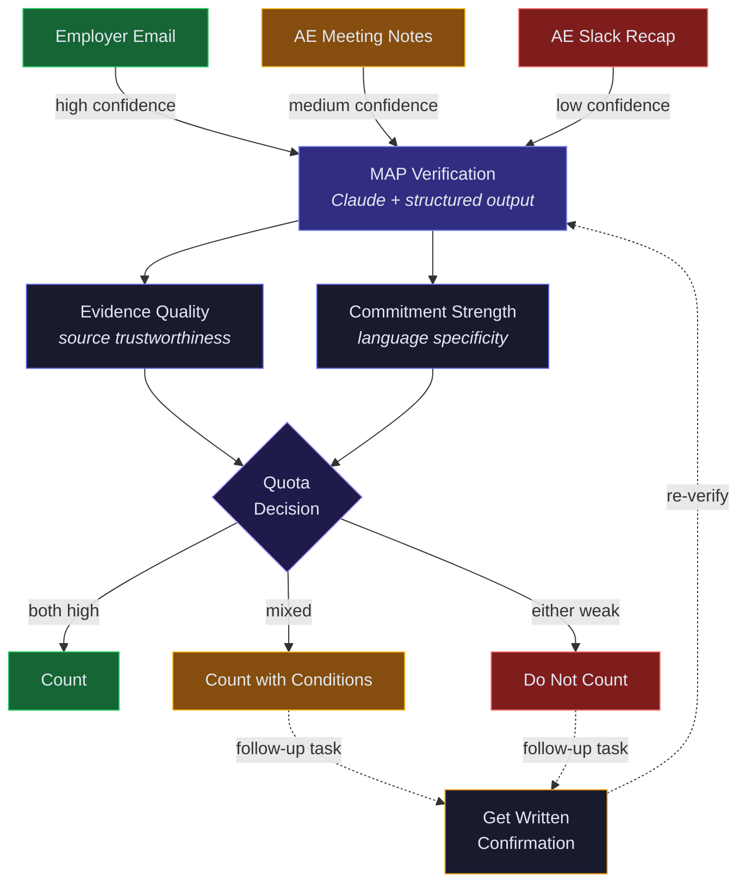

# MAP Verification System

Two-axis scoring of employer commitment evidence for Rula's AE sales motion. Separates **source trustworthiness** (evidence quality) from **commitment specificity** (commitment strength) to surface inflated MAPs before they reach the forecast.

## How it works

Unstructured evidence (emails, meeting notes, Slack messages) goes in. A structured verification assessment comes out — scored on two independent axes that determine a quota recommendation.

| Axis | What it measures | Scale |
|------|-----------------|-------|
| **Evidence Quality** | How trustworthy is the source? Employer email > AE meeting notes > AE Slack recap | 0–1 (strong / moderate / weak) |
| **Commitment Strength** | How firm is the language? Named campaigns + quarters > vague interest | 0–1 (firm / conditional / exploratory) |

The two scores combine into a **quota recommendation**: `count`, `count_with_conditions`, or `do_not_count`.

## Architecture



### Why Vercel now, Trigger.dev in production

The interactive demo runs on a **Vercel serverless function** (`api/verify.ts`) — a single request/response that returns in ~15 seconds. This is the right tool for a demo: zero infrastructure, instant deploys, no cold starts.

The **Trigger.dev task** (`src/trigger/mapVerification.ts`) is the production path. It adds the things a real deployment needs:

- **Retry with exponential backoff** — Anthropic rate limits or transient failures don't lose work. The task retries up to 3 times with randomized backoff (1–10s).
- **Queue-based execution** — CRM events (new activity, updated opportunity) trigger verification asynchronously. No user waiting on a spinner.
- **Long-running support** — `maxDuration: 120s` handles slow API responses without Vercel's 60s ceiling becoming a problem.
- **Observability** — Every run is logged in the Trigger.dev dashboard with status, duration, input/output, and retry history. No need to dig through Vercel function logs.

Both paths import the same `schemas.ts` and `prompt.ts` — the core logic is identical, only the execution wrapper differs.

## Project structure

```
├── api/
│   └── verify.ts              # Vercel serverless function (demo API)
├── src/
│   ├── schemas.ts             # Zod schemas — input validation + output format
│   ├── prompt.ts              # System prompt + evidence samples
│   └── trigger/
│       └── mapVerification.ts # Trigger.dev task (queue path)
├── demo/
│   └── index.html             # Static demo page (hardcoded results + interactive form)
├── vercel.json                # Rewrites + function config
├── trigger.config.ts          # Trigger.dev project config
└── DIAGRAM.md                 # Architecture diagram (Mermaid)
```

## Key design decisions

**Structured outputs over freeform** — `messages.parse()` with Zod schemas guarantees downstream systems get valid JSON matching `MAPVerification`. No regex, no "please respond in JSON" prompting.

**Two-axis scoring** — Evidence quality and commitment strength are scored independently. A reviewer can immediately tell whether a low score means "bad evidence" (AE Slack recap) or "weak commitment" (vague interest, no campaigns named). A single composite score would hide this distinction.

**Shared core modules** — `schemas.ts` and `prompt.ts` are imported by both runtime paths. Update the schema or prompt once, both paths stay in sync.

## Setup

### Prerequisites

- Node.js 18+
- Anthropic API key

### Install

```bash
npm install
```

### Environment

Create a `.env` file:

```
ANTHROPIC_API_KEY=your_key_here
```

### Run the demo locally

```bash
npx vercel dev
# Open http://localhost:3000
```

### Deploy the demo

```bash
vercel --prod --yes
```

Set `ANTHROPIC_API_KEY` in Vercel environment variables.

## Running on Trigger.dev

The Trigger.dev path is designed for production use — triggered by CRM events rather than a browser form.

### 1. Set up Trigger.dev

Create a project at [trigger.dev](https://trigger.dev) and update the project ID in `trigger.config.ts`:

```ts
export default defineConfig({
  project: "proj_your_project_id",
  // ...
});
```

Set `ANTHROPIC_API_KEY` in your Trigger.dev project's environment variables (Dashboard > Environment Variables).

### 2. Deploy the task

```bash
npx trigger.dev@latest deploy
```

This deploys `src/trigger/mapVerification.ts` as the `verify-map-evidence` task with the retry policy defined in `trigger.config.ts`.

### 3. Test from the dashboard

Use the Trigger.dev dashboard to trigger a test run. Paste one of the evidence samples from `src/prompt.ts`:

```json
{
  "account": "Meridian Health Partners",
  "evidence_type": "email",
  "content": "Email from David Chen (VP, Total Rewards) to AE, February 14: \"Thanks for the presentation yesterday. We're excited to move forward with Rula...\""
}
```

### 4. Connect to Salesforce (read-only)

To trigger verification from Salesforce activity data, create a new task that listens for CRM events and feeds evidence to `verify-map-evidence`.

**Salesforce Connected App setup:**

1. In Salesforce Setup, go to **App Manager > New Connected App**
2. Enable OAuth, select these scopes (minimum for read-only):
   - `api` — REST API access
   - `refresh_token, offline_access` — long-lived token for background tasks
3. Under **OAuth Policies**, set Permitted Users to "Admin approved users are pre-authorized"
4. Assign the Connected App to a **read-only integration user** via a Permission Set — do not use an admin account

**Recommended Salesforce objects to query:**

| Object | Field | Why |
|--------|-------|-----|
| `Task` / `Event` | `Description`, `Subject` | AE meeting notes and call summaries |
| `EmailMessage` | `TextBody`, `FromAddress` | Employer-originated emails (highest evidence quality) |
| `Opportunity` | `StageName`, `NextStep` | Stage changes that suggest MAP commitment |
| `ContentDocumentLink` | linked files | Attached MAP documents or screenshots |

**Environment variables for Trigger.dev:**

```
SALESFORCE_INSTANCE_URL=https://yourorg.my.salesforce.com
SALESFORCE_CLIENT_ID=your_connected_app_client_id
SALESFORCE_CLIENT_SECRET=your_connected_app_client_secret
SALESFORCE_REFRESH_TOKEN=your_refresh_token
```

**Example trigger pattern:** Create a scheduled Trigger.dev task that polls for new `Task` records where `Subject LIKE '%MAP%'` or `Description` mentions campaign commitments, then triggers `verify-map-evidence` for each. Alternatively, use Salesforce Platform Events or Outbound Messages to push updates to a webhook that triggers the task in real-time.

## Output schema

The `MAPVerification` schema returned by both paths:

| Field | Type | Description |
|-------|------|-------------|
| `evidence_quality` | `number (0–1)` | Source trustworthiness score |
| `evidence_quality_label` | `strong \| moderate \| weak` | Human-readable quality label |
| `commitment_strength` | `number (0–1)` | Commitment specificity score |
| `commitment_strength_label` | `firm \| conditional \| exploratory` | Human-readable strength label |
| `commitment` | `object` | Extracted details: committer, campaigns, timeline, quarters |
| `signals_for` | `string[]` | Evidence supporting a real commitment |
| `signals_against` | `string[]` | Evidence suggesting soft/uncertain commitment |
| `quota_recommendation` | `count \| count_with_conditions \| do_not_count` | Final recommendation |
| `reasoning` | `string` | Full reasoning narrative |
| `follow_up_actions` | `string[]` | Suggested next steps |
